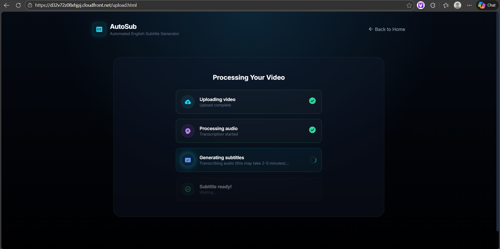

# Serverless Video Subtitle Generation Pipeline Using AWS

> An event-driven, AI-powered transcription system with multi-language support built on AWS serverless architecture.

[](https://aws.amazon.com/)
[](https://www.python.org/)
[](https://developer.mozilla.org/en-US/docs/Web/JavaScript)
[](LICENSE)

---

## 📸 Screenshots

### Landing Page

*Modern, responsive landing page with glassmorphism design*

### Upload Interface

*Drag-and-drop video upload with real-time progress tracking*

### Processing Status

*Live status updates during transcription*

### Download Subtitle

*Generated SRT subtitle ready for download*

### Architecture Diagram

*Complete AWS serverless architecture*

---

## 🚀 Features

- ✅ **Serverless Architecture** - No servers to manage, auto-scaling
- ✅ **Multi-Language Support** - English, Tamil, Hindi with auto-detection
- ✅ **Event-Driven Processing** - Automatic transcription on upload
- ✅ **Real-Time Status** - Live progress updates
- ✅ **Secure Upload/Download** - Presigned URLs, no credentials in frontend
- ✅ **Global CDN** - CloudFront for fast worldwide access
- ✅ **Cost-Effective** - Pay only for what you use (~$3/month for 100 videos)

---

## 🏗️ Architecture

### System Components

**Frontend Layer:**
- Amazon CloudFront (CDN + HTTPS)
- S3 Static Website Hosting

**API Layer:**
- Amazon API Gateway (REST API)
- 2 Endpoints: `/upload-url`, `/status`

**Compute Layer:**
- 3 AWS Lambda Functions:
  - Upload Lambda (presigned URL generation)
  - Processing Lambda (transcription trigger)
  - Status Lambda (job status checking)

**Storage & AI Layer:**
- S3 Videos Bucket (input)
- Amazon Transcribe (AI speech-to-text)
- S3 Subtitles Bucket (output)

**Security Layer:**
- AWS IAM (roles and policies)

### Workflow

```
User → CloudFront → S3 Website
  ↓
API Gateway → Upload Lambda → Presigned URL
  ↓
User uploads → S3 Videos Bucket
  ↓
S3 Event → Processing Lambda → Transcribe
  ↓
Transcribe → S3 Subtitles Bucket
  ↓
API Gateway → Status Lambda → Download URL
  ↓
User downloads subtitle
```

---

## 🛠️ Tech Stack

### Frontend
- HTML5, CSS3, JavaScript (ES6)
- Tailwind CSS
- Responsive Design

### Backend
- **AWS Lambda** - Python 3.14
- **Amazon Transcribe** - AI speech-to-text
- **Amazon S3** - Object storage
- **Amazon API Gateway** - REST API
- **Amazon CloudFront** - CDN
- **AWS IAM** - Security

### Tools
- Boto3 (AWS SDK for Python)
- AWS CLI

---

## 📋 Prerequisites

- AWS Account
- AWS CLI configured
- Basic knowledge of AWS services
- Python 3.14+
- Modern web browser

---

## 💰 Cost Estimate

**Monthly cost for 100 videos (1 minute each):**

| Service | Cost |
|---------|------|
| S3 Storage | ~$0.50 |
| Lambda Executions | ~$0.20 (free tier) |
| API Gateway | ~$0.10 (free tier) |
| Transcribe | ~$2.40 (100 min × $0.024/min) |
| CloudFront | FREE (free tier) |
| **Total** | **~$3.20/month** |

---

## 🎯 Use Cases

- 📹 Video content creators
- 🎓 Educational platforms
- 🎬 Media production companies
- 🌐 Multi-language content distribution
- ♿ Accessibility compliance

---

## 🔐 Security Features

- ✅ Presigned URLs (no AWS credentials in frontend)
- ✅ CORS configuration
- ✅ IAM least-privilege access
- ✅ S3 server-side encryption
- ✅ HTTPS enforced via CloudFront
- ✅ Private S3 buckets

---

## 🧪 Testing

### Upload a Test Video

1. Navigate to upload page
2. Drag and drop an MP4 file (max 500MB)
3. Wait for processing (2-5 minutes)
4. Download generated SRT subtitle

### Supported Formats

- **Input:** MP4 video files
- **Output:** SRT subtitle files
- **Languages:** English (en-US), Tamil (ta-IN), Hindi (hi-IN)

---

## 📊 Performance

- **Upload Speed:** ~10-30 seconds (depends on file size)
- **Processing Time:** ~2-5 minutes (depends on video length)
- **Download Speed:** ~1-2 seconds
- **Concurrent Users:** Auto-scales with Lambda

---

## 📝 License

This project is licensed under the MIT License - see the [LICENSE](LICENSE) file for details.

---


**⭐ If you found this project helpful, please give it a star!**
